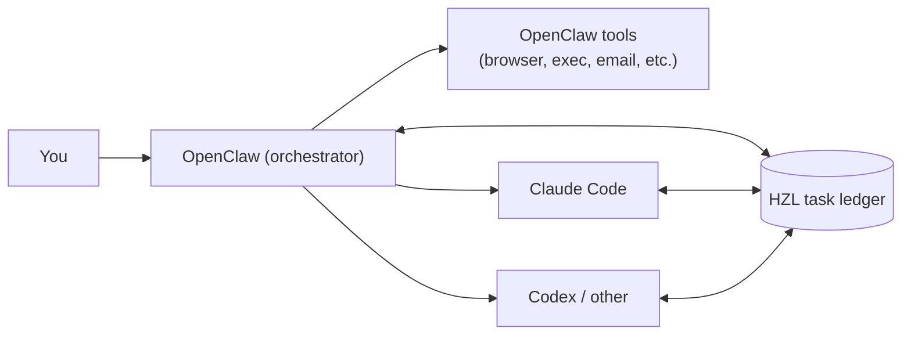
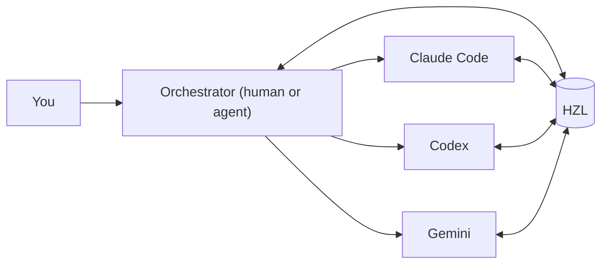
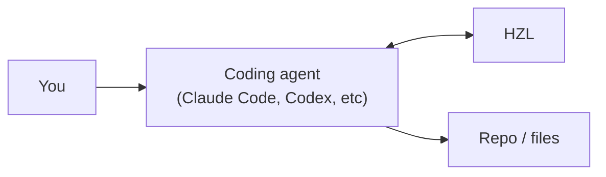
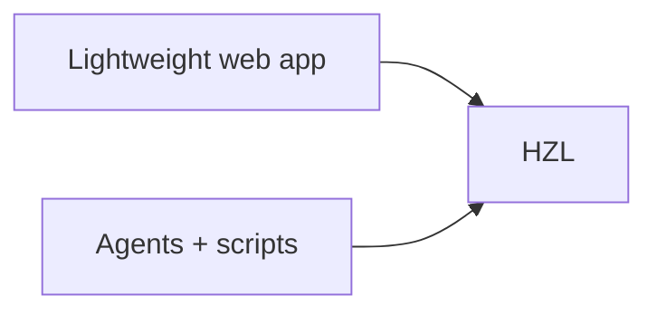
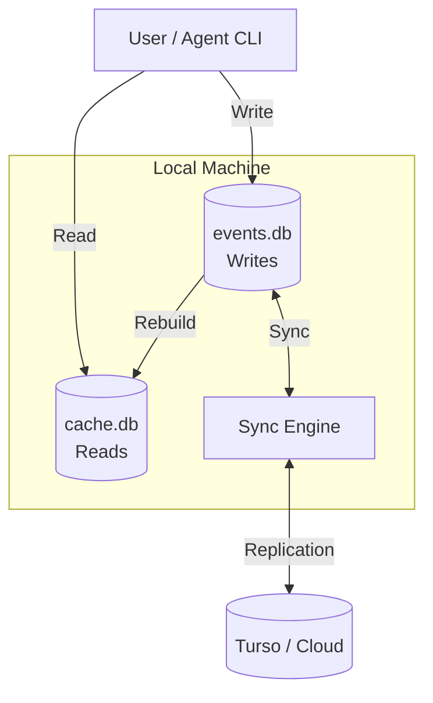

# HZL (Hazel)

**A shared task ledger for OpenClaw and poly-agent workflows.**

OpenClaw is great at doing work: running tools, coordinating sub-agents, and maintaining memory.
What it (and most agent tools) do not give you is a durable, shared backlog that survives:

- session boundaries
- crashes/reboots
- switching between different agent runtimes (Claude Code, Codex, Gemini, etc.)

HZL fills that gap: a lightweight, local-first task tracker that any agent can read/write.

Using OpenClaw? Start here: [OpenClaw integration](#openclaw-integration)

Not using OpenClaw? Jump to: [Using HZL with Claude Code, Codex, Gemini CLI, or any coding agent](#using-hzl-with-claude-code-codex-gemini-cli-or-any-coding-agent)

HZL provides:

- Projects and tasks
- Dependencies (`B` waits for `A`)
- Checkpoints (progress snapshots you can resume from)
- Leases (time-limited claims for multi-agent coordination)
- Event history (audit trail)
- Cloud Sync (multi-device/multi-agent synchronization with Turso)
- A CLI + JSON output that agents can script against

Data is stored in SQLite. Default location: `$XDG_DATA_HOME/hzl/data.db` (fallback `~/.local/share/hzl/data.db`); Windows: `%LOCALAPPDATA%\\hzl\\data.db`.

---

## Why another task tracker?

Because most task trackers are built for humans.

HZL is built for agents:

- It is backend-first, not UI-first. Think "task database with a CLI," not "another Trello."
- It is model-agnostic. Your tasks live outside any one vendor's memory or chat history.
- It is multi-agent safe. Leases prevent orphaned work and enable clean handoffs.
- It is resumable. Checkpoints let an agent crash, reboot, or swap models and keep going.

If you already have a favorite human todo app, keep it.
If you need a shared task state that multiple agents can read/write, that is HZL.

---

## Where HZL fits

### 1) OpenClaw orchestrator + sub-agents



OpenClaw coordinates the work. HZL is the shared, durable task board that OpenClaw and its sub-agents can use across sessions.

### 2) Any poly-agent system (no OpenClaw required)



Same idea: once you are switching tools/models, you need a shared ledger.

### 3) One agent, many sessions



Use HZL to persist "what's next" and "what changed" between sessions.

### 4) HZL as the backend for your own UI



HZL includes a basic [Kanban dashboard](#web-dashboard) for human visibility. For richer interfaces, build your own frontend using `hzl-core` directly—HZL stays the durable backend that both humans and agents can use.

---

## Quickstart

### Install

Requires Node.js 22.14+.

```bash
npm install -g hzl-cli
hzl init
```

### Enable Cloud Sync (Optional)

Sync with a Turso database for multi-device/multi-agent access:

```bash
hzl init --sync-url libsql://<db>.turso.io --auth-token <token>
```

### Create a project and tasks

```bash
hzl project create portland-trip

hzl task add "Check calendars for March weekends" -P portland-trip --priority 5
hzl task add "Research neighborhoods + activities" -P portland-trip --priority 4
hzl task add "Shortlist 2-3 weekend options" -P portland-trip --priority 3 \
  --depends-on <calendar-task-id> --depends-on <research-task-id>
```

### Work with checkpoints

```bash
hzl task claim <calendar-task-id> --author trevin-agent
hzl task checkpoint <calendar-task-id> "Found 3 options: Mar 7-9, 14-16, 21-23"
hzl task complete <calendar-task-id>
```

### Link to supporting documents

Tasks stay lightweight. Use `--links` to reference design docs, brainstorms, or specs:

```bash
# Create a task that links to context documents
hzl task add "Implement auth flow per design" -P myapp --priority 3 \
  --links docs/designs/auth-flow.md \
  --links docs/brainstorm/2026-01-auth-options.md

# The agent reads linked files for context, task stays focused on the work
hzl task show <id> --json
# → { "links": ["docs/designs/auth-flow.md", "https://somedomain/resource.md"], ... }
```

This pattern keeps tasks actionable while pointing agents to richer context stored elsewhere.

### Use JSON output when scripting

```bash
hzl task show <id> --json
hzl task next --project portland-trip --json
```

---

## Core concepts (the stuff that matters)

### Tasks are units of work, not reminders

HZL is optimized for "do work, report progress, unblock the next step."

If you need time-based reminders, pair HZL with a scheduler (cron, OpenClaw cron, etc.).

### Checkpoints are progress snapshots

A checkpoint is a compact, durable record of what happened:

- what you tried
- what you found
- what's still missing
- links, commands, or file paths needed to resume

### Dependencies encode ordering

Dependencies are how an agent avoids premature work:

- "Don't search flights before you know dates."
- "Don't open a PR before tests pass."

### Leases make multi-agent handoffs reliable

Leases are time-limited claims:

- A worker agent claims a task with `--lease 30`
- If it disappears, the lease expires
- Another agent can detect stuck work and take over

### Cloud Sync & Offline-First

HZL uses a **local-first** architecture. You always read/write to a fast local database. Sync happens in the background via Turso/libSQL.



---

## Patterns

### Pattern: Poly-agent backlog (recommended)

Conventions that help:

- Use consistent author IDs: `openclaw`, `claude-code`, `codex`, `gemini`, etc.
- Claim tasks before work.
- Checkpoint whenever you learn something that would be painful to rediscover.

Example handoff:

```bash
# Orchestrator creates task
hzl task add "Implement REST API endpoints" -P myapp --priority 2
TASK_ID=<id>

# Worker agent claims with a lease
hzl task claim "$TASK_ID" --author claude-code --lease 30
hzl task checkpoint "$TASK_ID" "Endpoints scaffolded; next: auth middleware"
hzl task complete "$TASK_ID"
```

### Pattern: Personal todo list (it works, but bring your own UI)

HZL can track personal tasks and has the advantage of centralizing agent and personal tasks.
This enables scenarios like OpenClaw assigning you tasks without needing to sync with other todo systems.

HZL itself is not trying to be a polished, human-first todo app. You bring other pieces for that.

If you want a todo app, build or use a UI:

- a tiny web app
- a TUI wrapper
- a menu bar widget

HZL stays the storage layer and concurrency-safe ledger underneath.

---

## Using HZL with Claude Code, Codex, Gemini CLI, or any coding agent

**Why HZL when your agent already has task tracking?**

Many coding agents (like Claude Code) have built-in task management. HZL complements rather than replaces it:

- **Cross-agent workflows**: If you use Claude Code *and* Codex *and* Gemini, each has its own task system. HZL is the shared ledger they can all read/write.
- **Session persistence**: Built-in task trackers often reset between sessions. HZL persists to disk (and optionally to cloud).
- **Orchestration**: When one agent delegates to another, HZL provides the handoff mechanism (claim, checkpoint, complete).
- **Backup**: With cloud sync enabled, your task state survives machine failures.

If you only ever use one agent and never need cross-session persistence, the built-in tracker is fine. Once you need durability or multi-agent coordination, reach for HZL.

If your coding agent supports an instruction file (for example `CLAUDE.md`, `AGENTS.md`, `GEMINI.md`, etc.), add a short policy so the agent reaches for HZL consistently.

### Drop-in policy snippet

```md
### HZL task ledger (durable, cross-agent task tracking)

HZL is a shared task database that persists across sessions and works across different agents.
Use it when work spans multiple sessions, involves handoffs to other agents, or needs durable backup.
If this agent has built-in task tracking, HZL complements it for cross-agent and multi-session work.

When to use HZL:
- Multi-session work that must survive restarts
- Coordination with other agents (Claude Code ↔ Codex ↔ Gemini, etc.)
- Work delegated to sub-agents that need explicit handoff
- When you need task state backed up to cloud

Workflow:
1) Create or use an HZL project for the work.
2) Break work into tasks with dependencies. Use `--links` to reference design docs or specs.
3) Claim tasks before work and checkpoint after meaningful progress.
4) Use `--json` when producing output another tool will parse.

Key commands:
- `hzl project create <name>`
- `hzl task add "<title>" -P <project> [--depends-on <id>] [--links <file>]`
- `hzl task claim <id> --author <agent-id> [--lease 30]`
- `hzl task checkpoint <id> "<progress + next step>"`
- `hzl task complete <id>`
```

That snippet is intentionally short. The goal is consistency, not ceremony.

### Claude Code marketplace (optional)

HZL includes a Claude Code plugin marketplace with skills that help agents work effectively with HZL.

```bash
# Add the marketplace
/plugin marketplace add tmchow/hzl

# Install the skills plugin
/plugin install hzl-skills@hzl-marketplace
```

See [`packages/hzl-marketplace`](./packages/hzl-marketplace) for details.

---

## OpenClaw integration

OpenClaw is a self-hosted AI assistant that can coordinate tools and sub-agents.
HZL fits well as the task ledger that OpenClaw (and its sub-agents) can share.

### Quick start (recommended)

Copy/paste this into an OpenClaw chat (single prompt):

```
Install HZL from https://github.com/tmchow/hzl and run hzl init. Install the HZL skill from https://www.clawhub.ai/tmchow/hzl. Then append the HZL policy from https://raw.githubusercontent.com/tmchow/hzl/main/docs/openclaw/tools-prompt.md to my TOOLS.md.
```

### Manual setup

1) Install HZL on the machine running OpenClaw:

```bash
npm install -g hzl-cli
hzl init
```

2) Install the HZL skill from https://www.clawhub.ai/tmchow/hzl  
   Skill source (for reference only): **[`docs/openclaw/skill-hzl.md`](./docs/openclaw/skill-hzl.md)**

3) Teach OpenClaw when to use HZL (important):
   - Copy/paste from: **[`docs/openclaw/tools-prompt.md`](./docs/openclaw/tools-prompt.md)**
   - Or tell OpenClaw to add this policy to `TOOLS.md`:

```
HZL is a tool available to you for task management in certain cases. I want you to add this information to your TOOLS.md in the right way so you remember how to use it:
https://raw.githubusercontent.com/tmchow/hzl/main/docs/openclaw/tools-prompt.md
```

---

## When to use HZL (and when not to)

### Use HZL when:

- work has multiple steps and you want explicit sequencing
- work spans multiple sessions (resume tomorrow with confidence)
- you are coordinating multiple agents or model providers
- you need durable status reporting (done / in progress / blocked / next)
- you want a task ledger your own UI can sit on top of

### Consider something else when:

- you need time-based reminders or notifications (use a scheduler + a notifier)
- you need rich human workflow features (due dates, recurring tasks, calendar views)
- you are tracking an org-wide backlog (GitHub/Jira/etc. may be a better fit)

---

## CLI reference (short)

```bash
# Setup
hzl init                                      # Initialize database (add --sync-url for cloud)
hzl init --reset-config                       # Reset config to default database location

# Projects
hzl project create <name>                     # Create a project
hzl project list                              # List all projects

# Tasks
hzl task add "<title>" -P <project>           # Create task (--depends-on, --links, --priority)
hzl task list --project <project>             # List tasks (--available for claimable only)
hzl task next --project <project>             # Get highest priority available task

# Working
hzl task claim <id> --author <name>           # Claim task (--lease <minutes> for expiry)
hzl task checkpoint <id> "<message>"          # Save progress snapshot
hzl task complete <id>                        # Mark done

# Coordination
hzl task stuck                                # Find expired leases
hzl task steal <id> --if-expired              # Take over abandoned task
hzl task show <id> --json                     # Task details (--json for scripting)

# Diagnostics
hzl sync                                      # Sync with cloud (if configured)
hzl status                                    # Show database and sync state
hzl doctor                                    # Health checks

# ⚠️ DESTRUCTIVE - deletes all data
hzl init --force                              # Prompts for confirmation before deleting
hzl init --force --yes                        # Deletes WITHOUT confirmation (dangerous)

# Web Dashboard
hzl serve                                     # Start dashboard (network accessible)
hzl serve --port 8080                         # Custom port
hzl serve --host 127.0.0.1                    # Restrict to localhost only
hzl serve --background                        # Fork to background
hzl serve --stop                              # Stop background server
hzl serve --status                            # Check if running
```

---

## Web Dashboard

HZL includes a lightweight Kanban dashboard for monitoring tasks in near real-time.

```bash
hzl serve                    # Start on port 3456 (network accessible by default)
hzl serve --host 127.0.0.1   # Restrict to localhost only
```

Open `http://localhost:3456` to see:

- **Kanban board** with columns: Backlog → Blocked → Ready → In Progress → Done
- **Date filtering**: Today, Last 3d, 7d, 14d, 30d
- **Project filtering**: Focus on a single project
- **Task details**: Click any card to see description, comments, and checkpoints
- **Activity panel**: Recent status changes and events
- **Mobile support**: Tabs layout on smaller screens

The dashboard polls automatically (configurable 1-30s interval) and pauses when the tab is hidden.

### Background mode

Run the dashboard as a background process:

```bash
hzl serve --background       # Fork to background, write PID
hzl serve --status           # Check if running
hzl serve --stop             # Stop the background server
```

### Running as a service (systemd)

For always-on access (e.g., on an OpenClaw box via Tailscale):

```bash
hzl serve --print-systemd > ~/.config/systemd/user/hzl-web.service
systemctl --user daemon-reload
systemctl --user enable --now hzl-web
```

The server binds to `0.0.0.0` by default, making it accessible over the network (including Tailscale). Use `--host 127.0.0.1` to restrict to localhost only.

---

## Packages

HZL is a monorepo with three packages:

| Package | Description | Install |
|---------|-------------|---------|
| [`hzl-cli`](https://www.npmjs.com/package/hzl-cli) | CLI for task management (`hzl` command) | `npm install -g hzl-cli` |
| [`hzl-core`](https://www.npmjs.com/package/hzl-core) | Core library for programmatic use | `npm install hzl-core` |
| [`hzl-web`](https://www.npmjs.com/package/hzl-web) | Web server and Kanban dashboard | `npm install hzl-web` |

Most users should install `hzl-cli`. Use `hzl-core` or `hzl-web` directly if you're building your own tooling or UI on top of HZL.

---

## License

MIT
