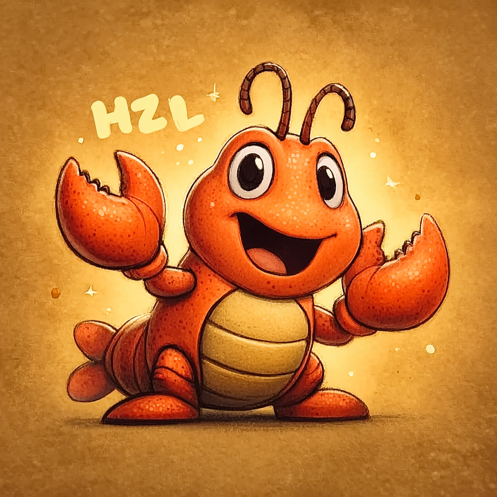

# HZL



A durable shared task ledger for [OpenClaw](https://openclaw.ai) and other multi-agent systems. Agents wake into fresh sessions — HZL preserves continuity across those wakes so they can resume work, hand off context, and coordinate through shared project pools.

## Install

```bash
npm install -g hzl-cli    # or: brew tap tmchow/hzl && brew install hzl
hzl init
```

## Documentation

Full docs at **[hzl-tasks.com](https://www.hzl-tasks.com)**

- [Getting Started](https://www.hzl-tasks.com/getting-started/) — installation, quickstart, agent setup
- [Concepts](https://www.hzl-tasks.com/concepts/) — tasks, dependencies, claiming & leases, lifecycle hooks, cloud sync
- [Workflows](https://www.hzl-tasks.com/workflows/) — single-agent, multi-agent, handoffs, oversight
- [Dashboard](https://www.hzl-tasks.com/dashboard/) — Kanban board, agent operations, graph view
- [CLI Reference](https://www.hzl-tasks.com/reference/cli/)
- [Hooks Reference](https://www.hzl-tasks.com/reference/hooks/) — configuration, payloads, delivery semantics
- [Architecture](https://www.hzl-tasks.com/reference/architecture/)
- [Troubleshooting](https://www.hzl-tasks.com/troubleshooting/)

## Orchestrator Primitives

HZL stays on the ledger side of the boundary. OpenClaw or another orchestrator should subscribe, poll, and decide what to do:

```bash
hzl events --follow              # raw NDJSON lifecycle feed
hzl stats --window 1h            # raw operational counters
hzl task stuck --json --stale    # recovery polling surface
hzl hook drain                   # deliver durable on_done hooks
```

## Links

- [Contributing](./CONTRIBUTING.md)
- [Changelog](./CHANGELOG.md)

## License

MIT

## Download History

[](https://skill-history.com/tmchow/hzl)
