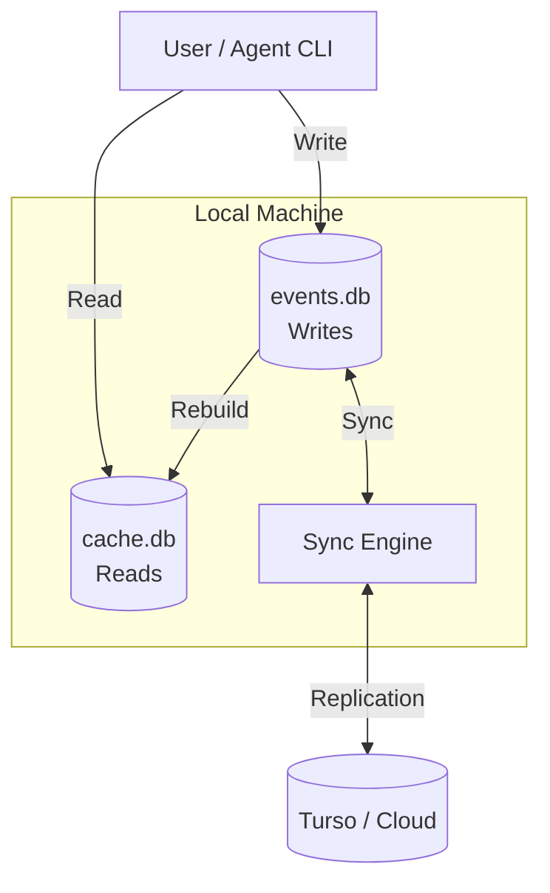

# Cloud Sync

Optional cloud synchronization for backup and multi-device access.

## Local-First Architecture

HZL uses a **local-first** design:

- All reads and writes go to local SQLite
- Fast, works offline
- Cloud sync happens in the background



## Why Cloud Sync?

- **Backup** - Data survives machine failures
- **Multi-device** - Access tasks from different machines
- **Multi-agent** - Agents on different machines share state
- **Collaboration** - Teams can share a task database

## Setting Up Cloud Sync

HZL integrates with [Turso](https://turso.tech) (libSQL).

### 1. Create a Turso Database

```bash
# Install Turso CLI
curl -sSfL https://get.tur.so/install.sh | bash

# Login
turso auth login

# Create database
turso db create hzl-tasks

# Get connection info
turso db show hzl-tasks --url
turso db tokens create hzl-tasks
```

### 2. Initialize HZL with Sync

```bash
hzl init --sync-url libsql://<db>.turso.io --auth-token <token>
```

Or add sync to existing installation:

```bash
hzl init --sync-url libsql://<db>.turso.io --auth-token <token>
```

### 3. Verify Sync

```bash
hzl status
```

Shows sync configuration and status.

## How Sync Works

### Writes

1. Event appended to local `events.db`
2. Projections rebuilt in local `cache.db`
3. Sync engine pushes to cloud (background)

### Reads

Always from local database. No network latency.

### Conflicts

HZL's event-sourced design minimizes conflicts:
- Events are append-only
- Atomic claiming prevents duplicate claims
- Sync merges events by timestamp

## Manual Sync

Force a sync:

```bash
hzl sync
```

Useful after reconnecting to network.

## Multi-Device Setup

Same database, different machines:

```bash
# Machine 1: Initialize with sync
hzl init --sync-url libsql://<db>.turso.io --auth-token <token>

# Machine 2: Initialize with same sync URL
hzl init --sync-url libsql://<db>.turso.io --auth-token <token>
```

Both machines now share the same task database.

## Offline Behavior

When offline:
- All operations work normally (local database)
- Changes queue for sync
- No errors or blocking

When reconnected:
- Queued changes sync automatically
- Or run `hzl sync` to force

## Security Considerations

- **Auth token** - Keep it secret, don't commit to repos
- **Database access** - Anyone with the token has full access
- **Network** - Data encrypted in transit (TLS)

Store credentials securely:

```bash
# Environment variable
export HZL_SYNC_TOKEN=<token>

# Or in config file (~/.config/hzl/config.json)
```

## Disabling Sync

To use local-only:

```bash
hzl init --reset-config
```

This resets to default local database without sync.

## Troubleshooting

### Sync Not Working

```bash
# Check status
hzl status

# Force sync
hzl sync

# Check for errors in output
```

### Stale Data

If data seems stale:

```bash
hzl sync
hzl task list  # Should show updated data
```

### Connection Issues

- Verify sync URL is correct
- Verify auth token is valid
- Check network connectivity
- Try `hzl sync` for detailed error messages
