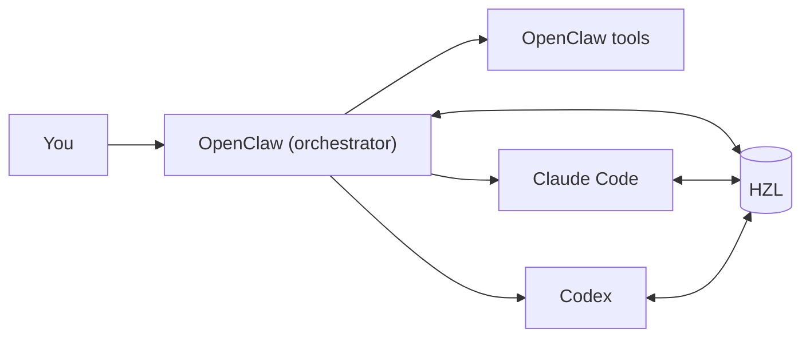
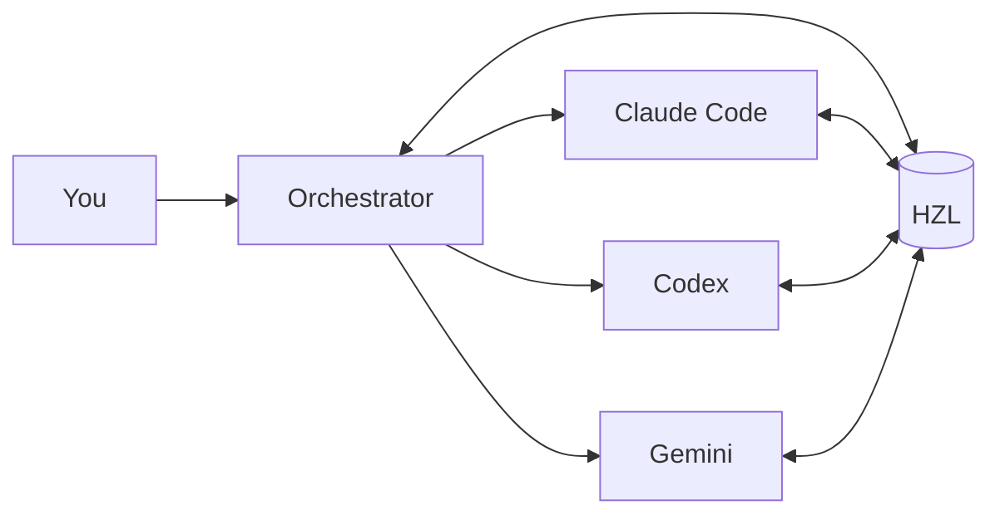
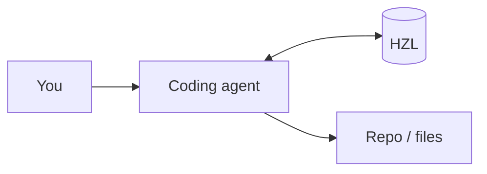
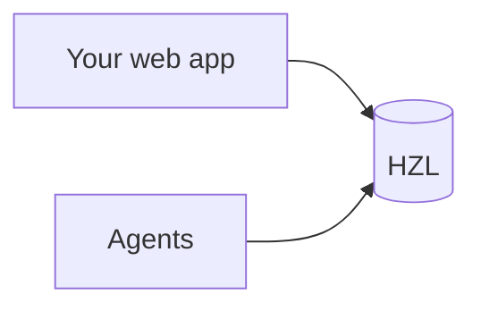

# Architecture

Technical overview of HZL's design for developers.

## System Overview

HZL is an event-sourced task coordination system with three main components:

```
┌─────────────┐     ┌─────────────┐     ┌─────────────┐
│   hzl-cli   │     │   hzl-web   │     │  Your App   │
│  (CLI tool) │     │ (dashboard) │     │ (optional)  │
└──────┬──────┘     └──────┬──────┘     └──────┬──────┘
       │                   │                   │
       └───────────┬───────┴───────────────────┘
                   │
            ┌──────▼──────┐
            │  hzl-core   │
            │  (library)  │
            └──────┬──────┘
                   │
            ┌──────▼──────┐
            │   SQLite    │
            │ events.db   │
            │ cache.db    │
            └─────────────┘
```

## Packages

| Package | Purpose | Install |
|---------|---------|---------|
| [`hzl-cli`](https://www.npmjs.com/package/hzl-cli) | Command-line interface | `npm install -g hzl-cli` |
| [`hzl-core`](https://www.npmjs.com/package/hzl-core) | Core library | `npm install hzl-core` |
| [`hzl-web`](https://www.npmjs.com/package/hzl-web) | Web dashboard | `npm install hzl-web` |

Most users install `hzl-cli`. Use `hzl-core` directly for programmatic access or custom integrations.

## Event Sourcing

HZL uses event sourcing: all state changes are recorded as immutable events.

### Events Database (`events.db`)

The source of truth. Contains append-only events:

- `TaskCreated`
- `TaskClaimed`
- `StatusChanged`
- `CheckpointAdded`
- `TaskCompleted`
- etc.

### Cache Database (`cache.db`)

Derived state (projections) rebuilt from events:

- `tasks_current` — Current task state
- `dependencies` — Task dependency graph
- `tags` — Tag assignments

**Key principle:** Never modify projections directly. All changes go through `EventStore.append()`.

## Data Flow

```
User Command
     │
     ▼
┌─────────────┐
│ CLI / API   │
└──────┬──────┘
       │
       ▼
┌─────────────┐
│TaskService  │  ← Business logic
└──────┬──────┘
       │
       ▼
┌─────────────┐
│ EventStore  │  ← Append event
└──────┬──────┘
       │
       ▼
┌─────────────┐
│ events.db   │  ← Persist
└──────┬──────┘
       │
       ▼
┌─────────────┐
│ Projections │  ← Rebuild cache
└──────┬──────┘
       │
       ▼
┌─────────────┐
│  cache.db   │
└─────────────┘
```

## Atomic Claiming

Task claiming uses `BEGIN IMMEDIATE` transactions to prevent race conditions:

```
Agent 1: SELECT task WHERE ready    → Task #1
Agent 2: SELECT task WHERE ready    → Task #1

Agent 1: BEGIN IMMEDIATE
Agent 1: UPDATE task SET claimed    → Success
Agent 1: COMMIT

Agent 2: BEGIN IMMEDIATE            → Blocks until Agent 1 commits
Agent 2: SELECT task WHERE ready    → Task #1 now claimed
Agent 2: ROLLBACK                   → Try again
Agent 2: SELECT task WHERE ready    → Task #2
```

Two agents calling `task next --claim` simultaneously will get different tasks.

## Database Location

### Production (installed CLI)

Uses [XDG Base Directory](https://specifications.freedesktop.org/basedir-spec/basedir-spec-latest.html):

| Data | Default Location |
|------|-----------------|
| Database | `$XDG_DATA_HOME/hzl/` → `~/.local/share/hzl/` |
| Config | `$XDG_CONFIG_HOME/hzl/` → `~/.config/hzl/` |

Resolution order: `--db` flag → `HZL_DB` env → config file → default.

### Development (from source)

Dev mode is automatic when running from the repo:

| Data | Location |
|------|----------|
| Database | `.local/hzl/` (in repo root) |
| Config | `.config/hzl/` (in repo root) |

This isolates development from production data.

## Cloud Sync

HZL supports optional sync to [Turso](https://turso.tech) (libSQL):

```
┌─────────────────────────────────────┐
│           Local Machine             │
│  ┌─────────┐      ┌─────────┐       │
│  │events.db│◄────►│cache.db │       │
│  └────┬────┘      └─────────┘       │
│       │                             │
│  ┌────▼────┐                        │
│  │  Sync   │                        │
│  │ Engine  │                        │
│  └────┬────┘                        │
└───────┼─────────────────────────────┘
        │
        ▼
┌─────────────┐
│   Turso     │
│  (Cloud)    │
└─────────────┘
```

- **Local-first:** All reads/writes go to local SQLite
- **Background sync:** Changes replicate to cloud asynchronously
- **Multi-device:** Cloud database enables cross-machine access

Configure with:

```bash
hzl init --sync-url libsql://<db>.turso.io --auth-token <token>
```

## Task Availability

A task is "available" (claimable) when:

1. Status is `ready`
2. All dependencies have status `done`
3. Not currently claimed by another agent

The `--available` flag and `task next` command filter to available tasks.

## Where HZL Fits

### With OpenClaw



### Multi-Agent System



### Single Agent, Multiple Sessions



### Custom UI Backend



## Building on HZL

For custom integrations, use `hzl-core` directly:

```javascript
import { createContext, TaskService } from 'hzl-core';

const ctx = await createContext({ dbPath: '~/.local/share/hzl' });
const taskService = new TaskService(ctx);

// Create task
const task = await taskService.createTask({
  title: 'My task',
  project: 'my-project',
});

// Claim task
await taskService.claimTask(task.id, { assignee: 'my-agent' });

// Add checkpoint
await taskService.addCheckpoint(task.id, 'Progress made');

// Complete
await taskService.completeTask(task.id);
```

See the [hzl-core package](https://www.npmjs.com/package/hzl-core) for full API documentation.
